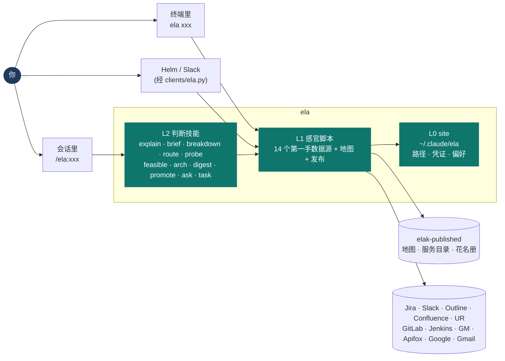
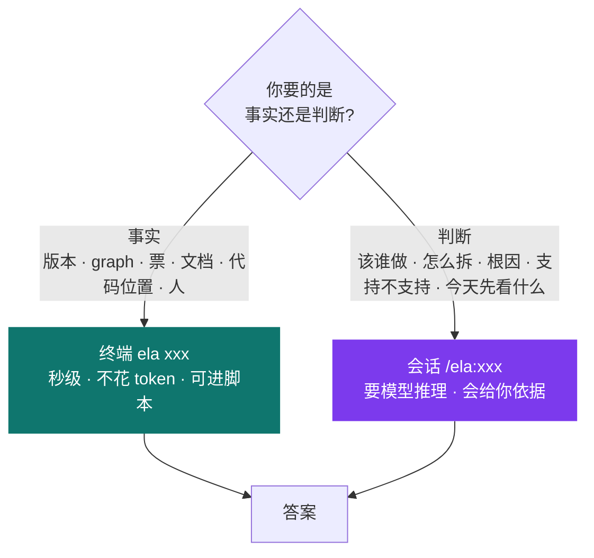
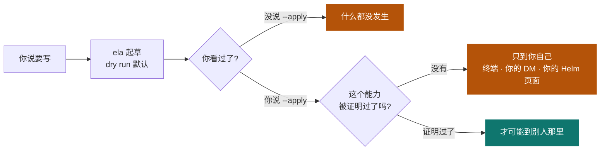
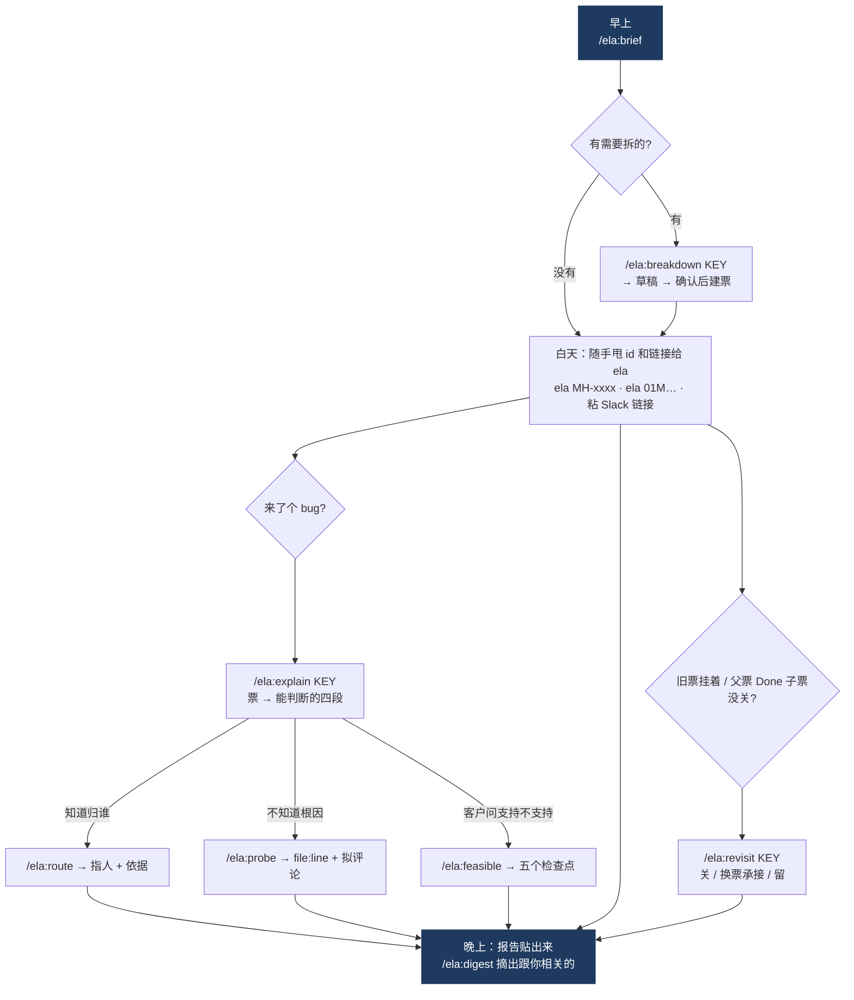

# ela 使用说明书

ela 是一个 Claude Code 插件加一个 `ela` 命令。它把做 MediaHub 产品的动作——**第一手去读、拆解、
定人、跟踪、自己动手改**——做成一套能力，在任何目录都在。这份说明书是正本，放在 ela 仓的
`docs/manual.md`，随代码一起改；`tests/run.sh` 会检查每个动词和每个 skill 都在这里出现过。

**版本** 0.37.0 · **入口**：会话里的 `/ela:xxx`、终端里的 `ela xxx`、Helm 的页面和 Slack bot（经
`clients/ela.py`）· **写操作全部默认 dry run**。

---

## 一、场景速查 — 遇到什么，用什么

| 你遇到的情况 | 用这个 | 最短起手式 |
|---|---|---|
| 早上打开电脑，不知道先看什么 | `brief` | `/ela:brief` |
| 一个复杂需求进来，要拆成各层的活并派人 | `breakdown` | `/ela:breakdown MH-3568` |
| 一张别人写的票落到你手上，先要看懂它才谈得上判断 | `explain` | `/ela:explain MH-3568` |
| 一张旧票挂了很久，先要判断它还有没有必要存在 | `revisit` | `/ela:revisit MH-1649` |
| 一个 bug 落到你手上，不确定归谁 | `route` | `/ela:route MH-3568` |
| 光定人不够，要看代码找根因 | `probe` | `/ela:probe MH-3568` |
| 客户问「你们支持 X 吗，能不能做」 | `feasible` | `/ela:feasible <thread 链接>` |
| 要对一个子系统做结构评审 | `arch` | `/ela:arch app-layer` |
| QA 日报 / 测试报告贴出来了，要知道哪些跟你有关 | `digest` | 把 Slack 永久链接贴给 ela |
| 有人甩来一个 graph id / process id / object id | `graph` · `object` | `ela 01M1GD1F…` · `ela <32位十六进制>` · `ela <19位数字>` |
| 「这个修复上 daily 了吗」「prod-3 是什么版本」 | `release` | `ela versions` · `ela bundles` · `ela builds <job>` · `ela drift` |
| QA 要推 daily、daily 要上 prod | `promote` | `ela promote 2.1 qa daily` |
| 「这个接口有哪些参数」 | `apifox` | `ela api read ur "GET /v1beta1/graphs/{graphId}"` |
| 「输出流里到底带了什么」 | `stream` | `ela stream probe <url>` · `ela stream diff <a> <b>` |
| 「这事以前写过没有」 | `kb` · `confluence` · `gdoc` | `ela kb search …` · `ela wiki search …` · `ela gdoc <链接>` |
| 「QA 报告邮件说了什么」「Sentry 今天报了什么」 | `mail` · `sentry` | `ela mail search 'newer_than:3d'` · `ela sentry` |
| 「这个服务的代码在哪」「谁负责这个镜像」 | `map` | `ela find copier` · `ela where media/tvu264` |
| 「这个人是谁」「谁管 UI 层」 | `team` | `ela who robin` · `ela team areas` |
| 要问另一个团队的 bot（边界 agent） | `ask` | `/ela:ask <graph id> <问题>` |
| 要自己动手改一个别人家的仓 | `task` | `/ela:task MH-3568 tvu264` |
| 要写 Jira / 发 Slack / 写 KB | 写原子 | 先 dry run，你说了再 `--apply` |
| 改了地图、花名册或一份知识文档，要让 Helm、远端和 ela 自己读到 | `publish` | `ela publish all` · `ela publish doc <路径>` · `ela publish list` |
| 换了机器 / token 过期了 | `setup` | `/ela:setup` |
| 想看 ela 自己现在什么状态 | `reports` | `ela reports list` |
| 临时目录占地方了 | `runtime` | `ela runtime status` · `ela runtime clean` |

---

## 二、两种用法的区别

**能不开会话就不开会话。** 查一个事实用命令，要判断才用会话。

命令行的**最短形**：直接把 id 或链接甩给 `ela`，它按形状认。

| 你粘的东西 | ela 认成 |
|---|---|
| `MH-3568` | Jira 票 |
| 26 位 ULID | graph |
| 32 位十六进制 | process，认不到再试 tangible |
| 19 位数字 | object，以及它在跑过的 graph |
| Slack / Jira / Confluence / Google Doc / Apifox 链接 | 对应的那一条 |

---

## 三、能力全景

### 感官 — 每个能读到什么

| 能力 | 读什么 | 什么时候用 |
|---|---|---|
| `jira` | 票的描述、链接、子任务、评论；JQL 搜索 | 有人给你一个票号或链接 |
| `slack` | 一个 thread、频道历史、@ 你的、你问了没人答的、成员表、附件 | 「谁在等我」「那个 thread 说了什么」 |
| `mail` | Gmail 搜索、一封信、一个 thread（只读） | QA 报告、发版通知、审批都是邮件 |
| `sentry` | 到邮箱的 Sentry 告警，按项目归组 | 「今天哪个环境在报错」 |
| `kb` | Outline 全文搜索、目录树、一篇正文 | 「KB 里写过没有」 |
| `confluence` | web 团队 wiki（`ela wiki …`） | web 团队的实现细节和 QA 手法 |
| `gdoc` | Google Docs / Sheets / Drive（只读） | 别人共享的服务表、owner 表 |
| `apifox` | 一个项目的 OpenAPI、某个操作的参数与返回（`ela api …`） | 「UR 这个接口收什么」 |
| `graph` | `ela graph <id>` 节点表（按 pipeline 顺序）· `ela process <id>` 进程实时记录 · `ela box <id>` 容量与负载 · `ela graphs [me\|邮箱]` 某人的 graph · `ela resolve <id>` 按形状认 · `ela envs` 探测顺序；`ela connect` / `ela exec` 进 box，`ela start` / `ela stop` 发送端进程（y/N） | 事故第一跳：这条流跑在哪、哪个盒子 |
| `object` | object 与 tangible | 从一个对象反查它在哪些 graph 里 |
| `stream` | 线上流的 PID 表、编码、分辨率；两条流逐字段比 | 「PID 生效了吗」「这两条流差在哪」 |
| `release` | `ela bundles` GM bundle 列表 · `ela bundle <name>` 物料单 · `ela versions` 各 lane 版本 · `ela builds <job>` Jenkins 构建 · `ela drift` 漂移；prod 用 `ela login tvu` 拿你自己的会话 | 「这个修复上哪个环境了」 |
| `team` | 花名册第一手：`who` · `areas` · `emails` · `check` 对照 Slack | 派票或 @ 人之前 |
| `figma` | 设计文件结构、节点文本、评论、截图 | 设计稿贴进来的时候 |

### 地图与发布

| 能力 | 做什么 |
|---|---|
| `map` | 世界上有什么：`find` · `where` · `services` · `coverage` · `missing` · `remote`（整个 GitLab 组）· `clone` · `sync` · `worktree` · `survey` · `probe`；依赖图由 `deps.py` 从 git ref 生成 |
| `publish` | 把 elak 的地图、服务目录、花名册和写好的知识文档（`doc`）渲染到 `elak-published`（地址替换成占位符），写清单；`list` 有漂移就 exit 1。**ela 自己的读动词也读 `elak-published`**，所以改了地图要 publish 一次 |
| `runtime` | 一次性工作目录：`status` 看有什么、`clean` 删掉（`--work` 连干净的 worktree 一起） |

### 判断 — 每个替你做什么决定

| 能力 | 替你决定 | 产出 |
|---|---|---|
| `explain` | 这张票上没有的四件事：有没有活的实例、票上写的修复还在不在、票面断言与 thread 里的决定差在哪、在等谁 | 四段，只活在对话里，不落盘 |
| `revisit` | 一张旧票还该不该留着：问题是否还在（票 → 报告 → 运行时 → 代码，答了就停）；票面上的「方案」不参与裁决 | 三个出口：关（附凭什么关）· 换票承接（附承接票号）· 留（附下一个技能） |
| `brief` | 今天哪些事在等你，按紧要排序 | 每条带一个拟好的动作，只读不发 |
| `breakdown` | 一个需求分成哪几层的活、谁做、什么顺序、怎么验 | 计划是草稿，建票要你明确确认 |
| `route` | 这个 bug 归哪个服务、哪个人；不确定时谁先查、查什么 | 一个人名 + 依据 |
| `probe` | 根因在哪一行 | file:line + 给报告人和 owner 各拟一条评论 |
| `feasible` | 「支持吗、能做吗」——五个检查点（配置 → 载荷 → 命令行 → 引擎 → 输出）逐一验 | 每项两个结论：今天怎样、能不能做，卡在哪一层 |
| `arch` | 一个子系统的结构结论：标准是什么、每条发现值多少票 | 从依赖图渲染的现状图 + 排序过的发现 |
| `digest` | 一份报告里哪些是你必须知道和处理的 | 新问题、路由、等你拍板的、过期的、该建的票 |
| `promote` | 两个 lane 之间的晋级风险：版本、提交、票、QA 证据、bundle 差异 | 排好序的评估 + 只含事实的 Slack 帖草稿 |
| `ask` | 该不该问另一个团队的 bot、问哪个、怎么问 | 它的回答加上它看不到的部分 |
| `task` | 一件你自己做的实现工作，从票到证据 | 独立 worktree，按目标仓自己的规矩做完，证据放 MR 或票 |

---

## 四、写操作的闸门 — 必须知道

**没有任何一个写操作会自己发生。**

四条规矩，写在原则和 ADR 里，不是习惯：

- **dry run 默认，`--apply` 才真发**，而且幂等——重复跑不会重复写。
- **能力没被证明之前，产出只到你一个人**（elak 原则 P7）。不进频道、不改别人的票、不由 bot 替你回别人。
- **你说的话是输入，不是产物**（ela ADR 0002）。你的消息不会原样进 commit、文档、规则或知识；ela 按目的地体裁改写，注明出处。只有你明确要求逐字记录时，你的句子才会出现在文件里。
- **写 elak 只在你说「记下来」之后，而且手工提交**（ADR 0001）。没有任何 hook 会提交或推送 elak。三个仓的提交都过内容守卫：凭证、地址、他人引语、会话叙事一律拒绝。

---

## 五、现在能信到什么程度

| 级别 | 含义 | 现在有哪些 |
|---|---|---|
| 🟢 **能用** | 跑过，结果可信 | 全部感官 · `map` · `publish` · `runtime` · `release`（含 prod，经你的登录）· `promote`（与 Helm 对比零差异）· `team` · `reports` · `setup` · 全部写原子（dry run） |
| 🟡 **建好了，没验够** | 能跑，但还没证明判断是对的 | `probe`（3 个根因里成了 1 个）· `brief`（两周窗口没开始）· `digest` · `feasible` · `arch` · `ask`（API 凭证未申请） |
| 🔴 **写好了，没真跑过** | 拿它做决定要自己复核 | `explain`（形状在一张票上手工演过，技能本身没跑过）· `revisit`（形状取自 MH-1649 / MH-2798 两张票的手工裁决，技能本身没跑过）· `breakdown`（从没跑过真需求）· `task`（委派链路没实跑过） |

**下一步最该做的一件事**：连续两周把 `/ela:brief` 当早上第一件事读，漏掉的记进 elak 的 `exit-evidence.md`。

---

## 六、一天怎么用

---

## 七、东西放在哪

| 放什么 | 在哪 | 规矩 |
|---|---|---|
| 能力定义、hooks、ela 自己的架构与决策（`docs/`） | ela 仓 | TVU 内部可看；不存知识、主机、凭证、任何人的话 |
| 知识：原则、决策、解读、地图 | elak 仓 | 只有你；你说「记下来」才写，手工提交 |
| 给机器读的子集：地图（地址已脱敏）、服务目录、花名册、发布过的知识文档 | `elak-published` | `ela publish` 生成，永不手改；ela 的读动词、Helm、远端都读这里 |
| 机器路径、凭证、你的工作偏好 | `~/.claude/ela/` | 从不进任何被跟踪的文件 |
| 别人家的代码（只读） | `<code>/<别名>/<远端路径>` | 改动一律在 `<work>/<KEY>/<仓>` 的 worktree 里 |
| 草稿、原始抓取、worktree | `<projects>/.ela` | 随时可删；`ela runtime clean` |
| 这些报告 | `<projects>/reports` | 你的私有阅读面；随时重生成 |

---

## 八、还没有的

| 缺什么 | 影响 | 排在哪 |
|---|---|---|
| `ela logs` · `ela inspect` · UR 诊断接口 | 进程日志和 box 状态还要人 ssh 上去看 | 阶段 5，等你的 go |
| headless 入口 `ela run <skill> --json` | Helm 的定时器还不能跑 ela 的判断 | 阶段 6 |
| 写的组合动作（nudge · 建票 from thread · 决策捕获） | 这些还得手写 | 阶段 6 |
| MCP | 别的模型还调不到 ela | 阶段 7 |
| Helm 重叠 skill 的退役 | 两份维护 | 每项按 parity 退役，条件写在 ROADMAP |
